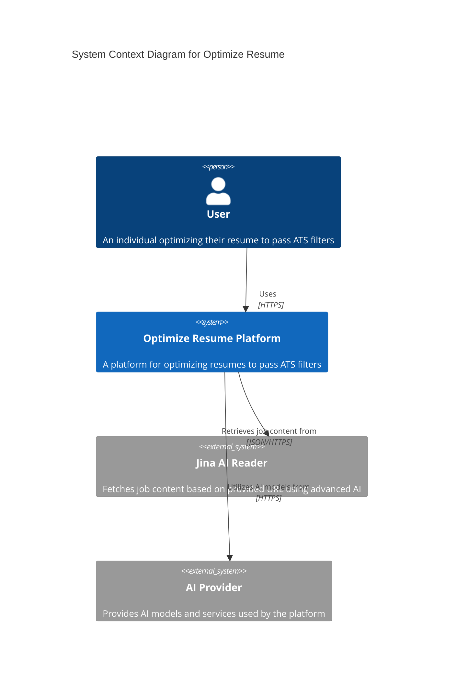
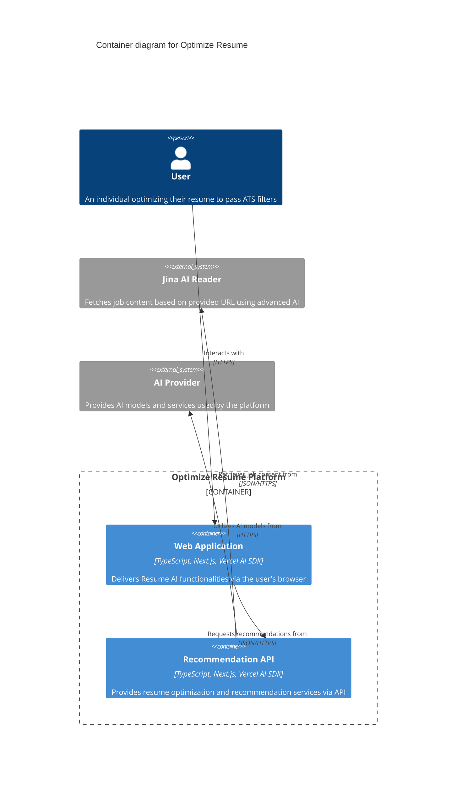

# Optimize Resume 🚀📄

Optimize Resume is an AI-powered platform designed to enhance your resume and increase your chances of passing Applicant Tracking Systems (ATS). Developed as part of a Vercel hackathon, this innovative solution aims to make job searches more efficient and effective.


## Table of Contents

1. [About the Project](#about-the-project)
2. [Features](#features)
3. [How It Works](#how-it-works)
4. [System Architecture](#system-architecture)
5. [Team](#team)
6. [Getting Started](#getting-started)
7. [Contributing](#contributing)
8. [License](#license)

## About the Project 🌟

Optimize Resume was created to address the common challenge job seekers face: getting their resumes past automated filtering systems. Our platform uses artificial intelligence to analyze job postings and your resume, suggesting improvements to make your application stand out to both ATS and human recruiters.

## Features ✨

- 🤖 AI-powered resume analysis
- 🎯 Job posting compatibility check
- 📊 Personalized optimization suggestions
- 📁 Support for PDF resumes up to 10MB
- 🖥️ User-friendly interface

## How It Works 🛠️

1. 📤 Upload your resume (PDF format, max 10MB)
2. 📝 Provide the job posting you're interested in
3. 🔍 Our AI analyzes both your resume and the job posting
4. 💡 Receive tailored suggestions to optimize your resume
5. 🚀 Implement the changes to increase your chances of success

## System Architecture 🏗️

### C4 Model Diagrams

#### System Context Diagram



#### Container Diagram



## Team 👥

Our diverse team of professionals brought this project to life:

- **Paul Chávez** - Full Stack Developer 💻
- **Luis Sullca H** - Back-End Developer 🔧
- **Micaela Leguizamon** - UX / UI Designer 🎨
- **Juan De León** - Front-End Developer 🖌️

## Getting Started 🚀

You will need:

- [Node.js 20+ (recommended 20.14 LTS)](https://nodejs.org/en/).
- [Git](https://git-scm.com/).

1. [Clone](https://github.com/developaul/optimize-resume.git) this repository locally:

```bash
git clone git@github.com:developaul/optimize-resume.git
```

2. Install dependencies:

```bash
# Install bun globally if you don't have it:
npm install -g bun

# and install dependencies:
bun install
```

3. Run the development server:

```bash
bun run dev
```

## Contributing 🤝

We welcome contributions to Optimize Resume! If you have suggestions for improvements or encounter any issues, please feel free to open an issue or submit a pull request.

## License 📄

Optimize Resume is open-source software licensed under the MIT license.

---

Optimize Resume: Your CV, ready to conquer ATS and land your dream job! 💼✨
